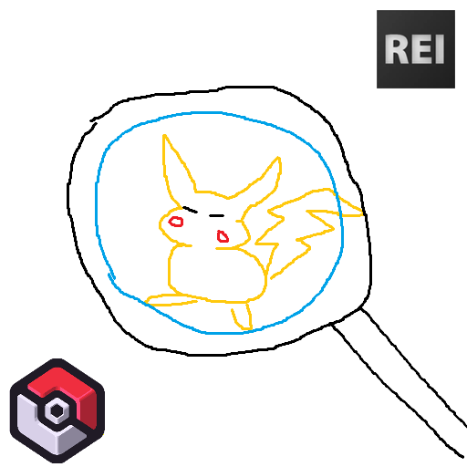

<p align="center"></p>

# Cobbliki REI

A client-side [REI](https://modrinth.com/mod/rei) (Roughly Enough Items) integration for
[Cobblemon](https://modrinth.com/mod/cobblemon). It turns the REI panel into a Pokédex of
*game data* — drops, moves, evolutions and more — read **live** from whatever Cobblemon content
you actually have installed. Nothing is hardcoded: it reflects your mods, datapacks and configs.

## Features

Each is a normal REI category — press **R** (recipe) or **U** (uses) on an item or Pokémon.

- **Defeat Drops** — what a Pokémon drops when beaten (with % and quantity).
- **Pasture Loot** — passive drops from a pastured Pokémon *(needs pastureLoot)*.
- **TM Compatibility** — a Pokémon's learnable TM/Tutor/Egg moves, with type icon, power, accuracy
  and PP; hover for the full effect. Per **form** (Alolan, Hisui, Mega, …).
- **Compatible Pokémon** — press U on a move (or a tmcraft disc) to see every Pokémon that learns it.
- **Move Details** — a move's full sheet.
- **Evolution** / **Evolution Item** — how a Pokémon evolves (level / friendship / trade, or via an
  item / Link Cable), and what it evolves from/into — form-aware.
- **Mega Evolution** — Mega Stone → species → Mega form *(needs Cobblemon: Mega Showdown)*.
- **Fossil / Resurrection** — fossils → revived Pokémon, including datapack legendaries.
- **Buy / Sell** — CobbleDollars shop & bank prices *(needs CobbleDollars)*.
- Every Pokémon and move is a searchable REI entry, with the live 3D model.

## Dependencies

**Required:** Minecraft 1.21.1 · Fabric Loader · [Fabric API](https://modrinth.com/mod/fabric-api) ·
[Fabric Language Kotlin](https://modrinth.com/mod/fabric-language-kotlin) ·
[Cobblemon](https://modrinth.com/mod/cobblemon) 1.7.x ·
[Roughly Enough Items](https://modrinth.com/mod/rei) 16.x

**Optional (categories appear only when present):**
[CobbleDollars](https://modrinth.com/mod/cobbledollars) ·
[tmcraft](https://modrinth.com/mod/tmcraft) ·
[Cobblemon: Mega Showdown](https://modrinth.com/mod/cobblemon-mega-showdown) · pastureLoot

Client-side only — it reads client-synced registries, the mod jars, datapacks and configs. On a
remote server, content that the server never syncs to clients (e.g. datapack-only learnsets) may be
unavailable; in singleplayer/LAN it's complete.

## Building

```bash
./gradlew build   # -> build/libs/cobbliki-rei-<version>.jar
```

## Releasing (maintainers)

Bump `modVersion` in `gradle.properties`, then:

```bash
gh release create v<version> build/libs/cobbliki-rei-<version>.jar --repo ePaint/cobbliki-rei
uv run tools/modrinth_publish.py          # publishes to Modrinth (beta); --release for release type
```

`modrinth_publish.py` reads `MODRINTH_API_TOKEN` (env var or a sibling `.env`), builds if needed,
skips versions that already exist, keeps the project client-side, and uploads with dependencies.

## Credits

- The **CobbleDollar coin** icon (`assets/cobbliki_rei/textures/gui/cobbledollar.png`) is derived from
  the [**CobbleDollars**](https://modrinth.com/mod/cobbledollars) mod by Harmex; all rights to that
  artwork remain with its author. Used with credit.
- Pokémon models, type icons and species data are Cobblemon's, rendered via its own client API.

## License

[MIT](LICENSE) © ePaint
